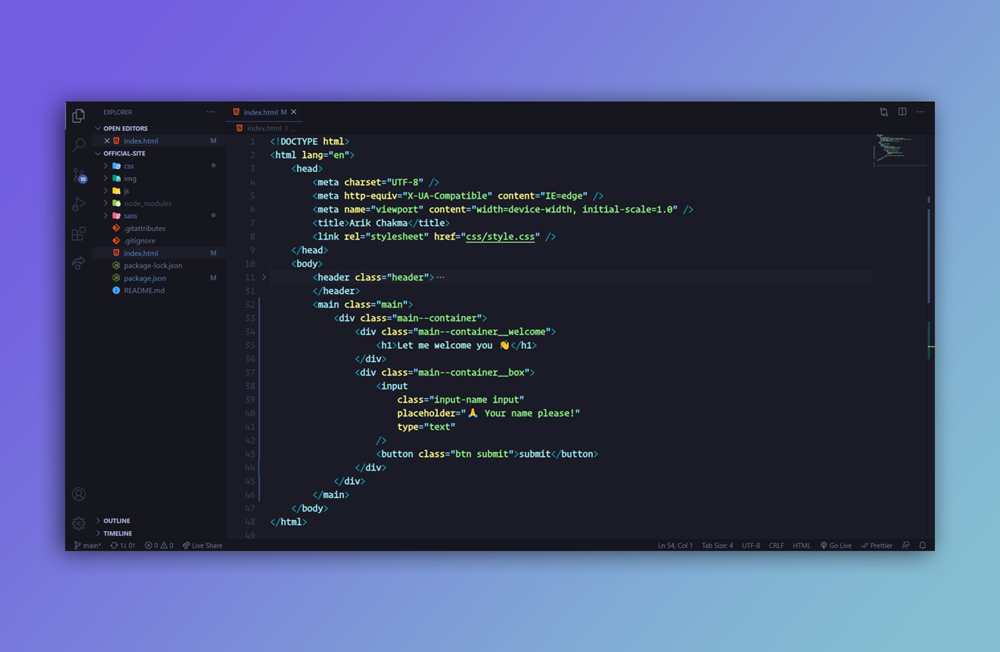
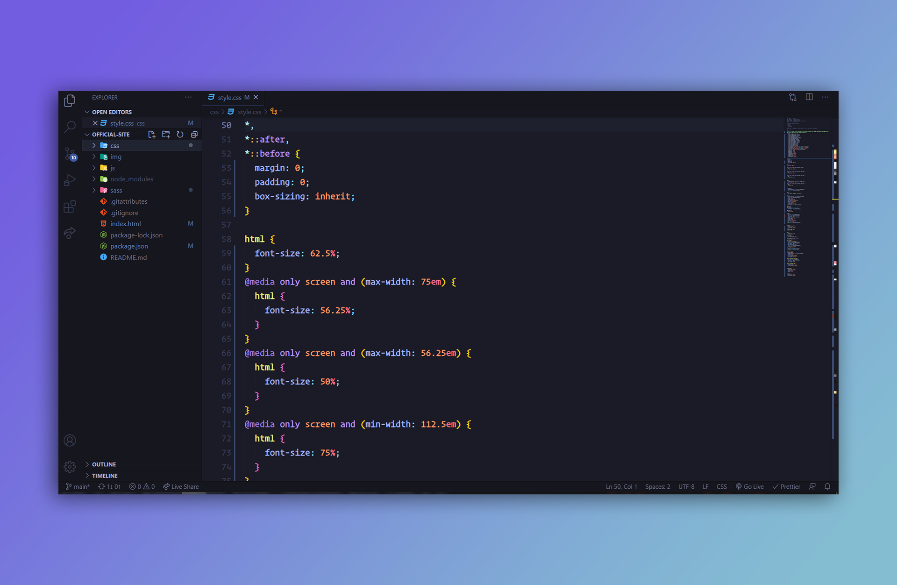
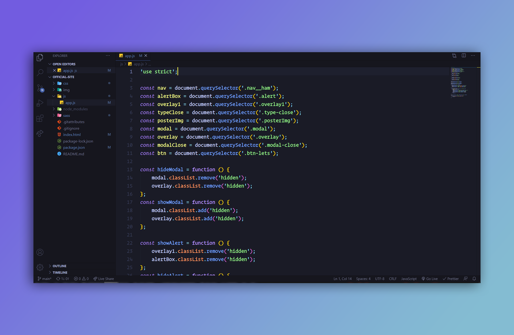

<p align="center"></p>

## Brought to you by

- <a style="font-weight: 500;" title="Arik Chakma" href="https://facebook.com/ArikChakmaOfficial">Arik Chakma</a>'s official visual studio code theme.
- Will be maintaining this whenever I get time, thanks for your understanding!

---

## Inspired

I took inspiration from the [Tokyo Night](https://marketplace.visualstudio.com/items?itemName=enkia.tokyo-night) theme which I was using around 5/6 months.

---

## Theme Screenshots

<p align="center"></p>
<p align="center"></p>
<p align="center"></p>

---

### Installation

Launch _Quick Open_:

-  <a href="https://code.visualstudio.com/shortcuts/keyboard-shortcuts-linux.pdf">Linux</a> `Ctrl+P`
-  <a href="https://code.visualstudio.com/shortcuts/keyboard-shortcuts-macos.pdf">macOS</a> `⌘P`
-  <a href="https://code.visualstudio.com/shortcuts/keyboard-shortcuts-windows.pdf">Windows</a> `Ctrl+P`

Paste the following command and press `Enter`:

```shell
ext install arikko-s-theme theme
```

## Activate theme

Launch _Quick Open_:

-  <a href="https://code.visualstudio.com/shortcuts/keyboard-shortcuts-linux.pdf">Linux</a> `Ctrl + Shift + P`
-  <a href="https://code.visualstudio.com/shortcuts/keyboard-shortcuts-macos.pdf">macOS</a> `⌘ + Shift + P`
-  <a href="https://code.visualstudio.com/shortcuts/keyboard-shortcuts-windows.pdf">Windows</a> `Ctrl + Shift + P`

Type `theme`, choose `Preferences: Color Theme`, and select Arikko's Dark from the list. After activation, the theme will be activated.

---

### My settings for visual studio✌

- To get the same look as mine, you can use my settings to. I also use some extra extensions like Image Preview, Better Comments and so on.
- You'll find them in vs code marketplace.

```js
{
	"workbench.colorTheme": "Arikko's Dark",
	"editor.fontFamily": "Operator Mono",
	"editor.fontLigatures": true,
	"editor.fontSize": 18,
	"editor.fontWeight": "600",
	"editor.lineHeight": 28,
	"editor.cursorBlinking": "expand",
	"files.autoSave": "afterDelay",
	"prettier.useTabs": true,
	"prettier.singleQuote": true,
	"editor.cursorWidth": 3,
	"editor.wordWrap": "on",
	"editor.wordWrapColumn": 75,
	"editor.defaultFormatter": "esbenp.prettier-vscode",
	"[javascript]": {
		"editor.defaultFormatter": "esbenp.prettier-vscode"
	},
	"editor.formatOnSave": true,
	"editor.formatOnPaste": true,
}

```

## <h2 align="center" style="font-weight: bold;">PEACE</h2>
